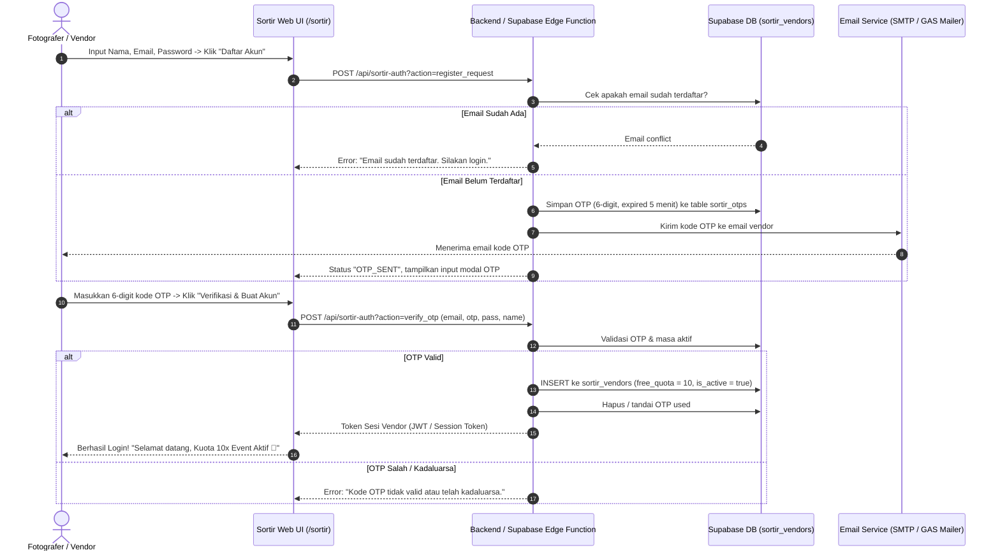
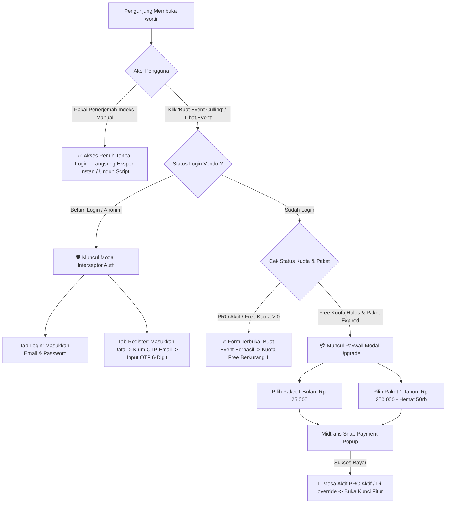

# Technical Specification — SapaTamu Sortir v3.5 (Hybrid Access, Email OTP Auth & Subscription SaaS)

> Dokumen spesifikasi teknis arsitektur, basis data, alur autentikasi OTP, manajemen kuota, dan integrasi payment gateway pada platform [Dashboard Culling — SapaTamu Sortir](https://sapatamu.id/sortir).

---

## 1. 🏗️ Arsitektur Pembagian Tingkat Akses (Tiering)

Halaman `/sortir` dibagi menjadi dua tingkat akses yang jelas tanpa merusak aksesibilitas publik:

```
+-------------------------------------------------------------------------------+
|                    HALAMAN /sortir (SapaTamu Sortir)                          |
+-------------------------------------------------------------------------------+
|  [OPEN-SOURCE & FREE ZONE] — Siapa Saja Bebas Akses (Tanpa Login / Anonim)   |
|  - 📋 Penerjemah Indeks Manual (Parse WA/Email -> Ekspor Instan & Script)     |
+-------------------------------------------------------------------------------+
|  [GATED SAAS ZONE] — Wajib Login Akun Vendor Terverifikasi                   |
|  - 📅 Form Buat Event Culling Baru (Memeriksa Kuota / Subscription)           |
|  - 📂 Daftar Event Saya (Query Supabase berdasarkan vendor_id)               |
|  - ⚡ Ekspor Hasil Seleksi Cloud & Live Real-Time Dashboard                   |
|  - 📱 Sesi Presensi & P2P Sharing                                             |
+-------------------------------------------------------------------------------+
```

### Tabel Matriks Akses Fitur

| Fitur / Section | Pengunjung Anonim (Belum Login) | Akun Free Tier (Login) | Akun Berlangganan PRO (Login) |
| :--- | :---: | :---: | :---: |
| **📋 Penerjemah Indeks Manual** | ✅ Bebas Unlimited | ✅ Bebas Unlimited | ✅ Bebas Unlimited |
| **⚡ Ekspor Instan via Browser (Manual)** | ✅ Tersedia | ✅ Tersedia | ✅ Tersedia |
| **💻 Unduh Script Portabel (.bat/.command)** | ✅ Tersedia | ✅ Tersedia | ✅ Tersedia |
| **📅 Buat Event Culling Cloud** | 🔒 *Interseptasi Modal Login* | ✅ Kuota 10x Event | ✅ Unlimited Event |
| **📂 Akses Daftar Event Saya** | 🔒 *Form Login & Info Benefit* | ✅ Event Milik Sendiri | ✅ Event Milik Sendiri |
| **⚡ Ekspor Seleksi Klien (Cloud Event)** | 🔒 *Interseptasi Modal Login* | ✅ Tersedia | ✅ Tersedia |
| **👑 Badge Status Akun** | `Masuk / Daftar` | `[Free: X/10 Event]` | `[👑 PRO s.d DD/MM/YYYY]` |

---

## 2. 🔐 Alur Registrasi & Autentikasi dengan OTP Email

Setiap vendor baru wajib memverifikasi kepemilikan email melalui kode 6-digit OTP sebelum akun aktif. **1 Email hanya dapat didaftarkan untuk 1 akun saja (Unique Constraint).**

### 2.1 Diagram Alur Registrasi OTP



---

## 3. 💳 Model Monetisasi & Kuota Berlangganan (Subscription)

### 3.1 Skema Paket & Harga

| Paket | Biaya | Durasi Aktif | Kuota Event | Keterangan |
| :--- | :---: | :---: | :---: | :--- |
| **Free Tier** | **Rp 0** | Selamanya | **10 Event** | Diberikan otomatis saat akun pertama kali berhasil mendaftar. |
| **PRO 1 Bulan** | **Rp 25.000** | 30 Hari | **Unlimited** | Cocok untuk vendor dengan jadwal event bulanan reguler. |
| **PRO 1 Tahun** | **Rp 250.000** | 365 Hari | **Unlimited** | **Hemat Rp 50.000** (*Setara 2 bulan gratis dibanding beli bulanan*). |

---

### 3.2 Logika Override Durasi & Perpanjangan

Jika vendor masih memiliki sisa hari aktif dan memutuskan untuk melakukan perpanjangan / upgrade paket:
1. **Aturan Override**: Masa aktif diperbarui dari tanggal transaksi baru (di-reset dengan durasi paket terbaru, misal +30 hari atau +365 hari dari `NOW()`).
2. **Kompensasi Fleksibel**: Transaksi baru langsung mengaktifkan tier PRO seketika setelah pembayaran Midtrans berstatus `settlement` / `capture`.

---

## 4. 🗄️ Skema Database Supabase (PostgreSQL)

```sql
-- 1. TABEL VENDOR SORTIR
CREATE TABLE IF NOT EXISTS public.sortir_vendors (
    id UUID PRIMARY KEY DEFAULT gen_random_uuid(),
    vendor_name VARCHAR(255) NOT NULL,
    email VARCHAR(255) UNIQUE NOT NULL,
    password_hash TEXT NOT NULL,
    whatsapp_number VARCHAR(50),
    free_quota_remaining INT DEFAULT 10,
    subscription_plan VARCHAR(50) DEFAULT 'free', -- 'free', 'monthly', 'yearly'
    subscription_started_at TIMESTAMPTZ,
    subscription_expires_at TIMESTAMPTZ,
    is_active BOOLEAN DEFAULT TRUE,
    created_at TIMESTAMPTZ DEFAULT NOW(),
    updated_at TIMESTAMPTZ DEFAULT NOW()
);

-- Index untuk performa query auth & presence
CREATE INDEX IF NOT EXISTS idx_sortir_vendors_email ON public.sortir_vendors(email);

-- 2. TABEL OTP REGISTRASI
CREATE TABLE IF NOT EXISTS public.sortir_otps (
    id UUID PRIMARY KEY DEFAULT gen_random_uuid(),
    email VARCHAR(255) NOT NULL,
    otp_code VARCHAR(6) NOT NULL,
    expires_at TIMESTAMPTZ NOT NULL,
    is_used BOOLEAN DEFAULT FALSE,
    created_at TIMESTAMPTZ DEFAULT NOW()
);

-- 3. PERBARUI TABEL EVENT CULLING DENGAN RELASI VENDOR
ALTER TABLE public.sortir_events 
ADD COLUMN IF NOT EXISTS vendor_id UUID REFERENCES public.sortir_vendors(id) ON DELETE SET NULL;

CREATE INDEX IF NOT EXISTS idx_sortir_events_vendor_id ON public.sortir_events(vendor_id);

-- 4. TABEL RIWAYAT TRANSAKSI / SUBSCRIPTION
CREATE TABLE IF NOT EXISTS public.sortir_transactions (
    id UUID PRIMARY KEY DEFAULT gen_random_uuid(),
    vendor_id UUID REFERENCES public.sortir_vendors(id) ON DELETE CASCADE,
    order_id VARCHAR(100) UNIQUE NOT NULL,
    plan_type VARCHAR(50) NOT NULL, -- 'monthly' (25rb) / 'yearly' (250rb)
    gross_amount NUMERIC NOT NULL,
    payment_status VARCHAR(50) DEFAULT 'pending', -- 'pending', 'settlement', 'expire', 'cancel'
    snap_token TEXT,
    payment_response JSONB,
    created_at TIMESTAMPTZ DEFAULT NOW(),
    settled_at TIMESTAMPTZ
);
```

---

## 5. 🎯 Alur Interseptasi UI/UX (User Flow)



---

## 6. 📱 Standar Responsif 3-Mode (UI/UX)

- **Desktop ($\ge 1024$px)**:
  - Header memuat informasi profil vendor + badge `[Free: X/10]` atau `[👑 PRO]`.
  - Panel dashboard 2-kolom seimbang dengan kartu paywall interaktif.
- **Tablet (768–1023px)**:
  - Modal OTP & Paywall dirancang dengan lebar 90% (max-width: 480px), touch targets $\ge 48$px.
- **Mobile (<768px)**:
  - Input OTP 6-digit otomatis split kotak (auto-focus next input).
  - Tombol aksi full-width dengan sticky bottom bar jika diperlukan.
